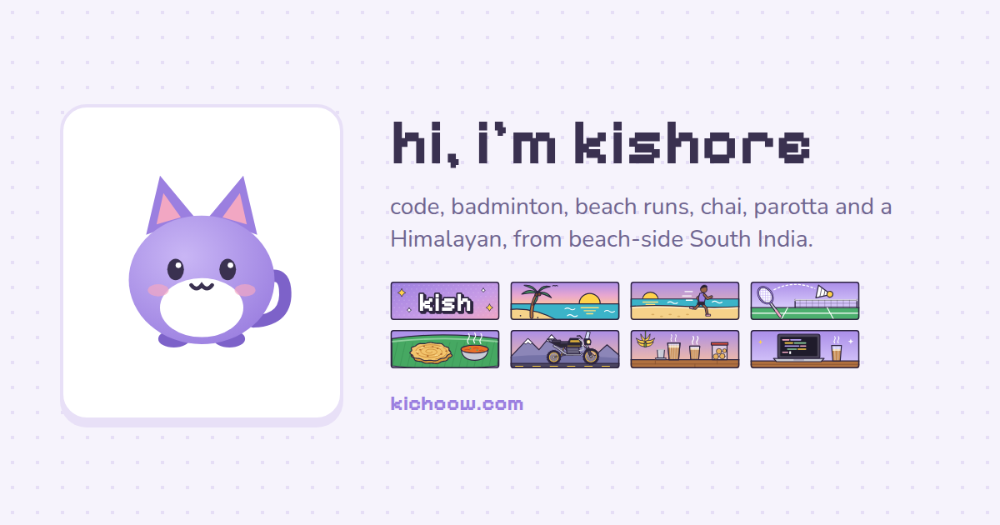

# home

[](https://kichoow.com)

kishore’s little corner of the internet. A soft lavender personal site: React + TypeScript + Vite, on a Cloudflare Worker with static assets.

Live at **[kichoow.com](https://kichoow.com)**.

Coding agents: read [AGENTS.md](AGENTS.md) for the rules, commands, tests and how to ship.

## What is on the page

| Part | Data | Needs |
|---|---|---|
| Intro, about, links, email | `src/data.ts` | Nothing |
| Mascot (click to pat) and pat count | Cloudflare D1 | D1 binding (below) |
| Status | [status.cafe](https://status.cafe) | `statusCafe` in `src/data.ts` |
| Stats: updated, views | Build date + D1 | D1 binding |
| Right now: music | Your phone's scrobbler → D1 | `SCROBBLE_TOKEN` (below) |
| Right now: building | Latest public GitHub push | `github` in `src/data.ts` |
| Right now: local time | Browser | `timeZone` in `src/data.ts` |
| Counts: parotta, chai, beach days | The `/log` page → D1 | `SCROBBLE_TOKEN` (below) |
| Updates, 88×31 buttons | `src/data.ts`, `public/*.svg` | Nothing |
| ⌘K menu | cmdk | Nothing |

Only real data is shown. A part with no data is hidden.

## Local development

```sh
npm install
npm run dev         # Vite dev server (no Worker, no service worker)
npm run build       # type-check, build, pre-render, service worker → dist/
npm run preview     # build, then run the Worker and the site locally (wrangler dev)
npm run lint        # oxlint
npm run audit       # build, then the UI tests in a real browser (see Test below)
npm run cf-typegen  # regenerate worker-configuration.d.ts
```

## Test

`npm run audit` builds the site and runs `tests/ui.spec.ts` with [Playwright](https://playwright.dev) on a desktop and a mobile (Pixel 7) browser, with [axe-core](https://github.com/dequelabs/axe-core-npm/tree/develop/packages/playwright) for accessibility. It checks every tap target, the ⌘K menu, the offline page and service worker, the 404 page, layout width, keyboard use and the Umami events (captured, never sent).

```sh
npx playwright install chromium   # once
npm run audit                     # or: CHROMIUM_PATH=/path/to/chrome npm run audit
```

The site runs locally with `wrangler dev`, and the test browser opens it as `http://kichoow.com`, so Umami's domain check and the service worker work as on the live site. A failed test leaves a trace and an HTML report in `.context/` (`npx playwright show-report .context/playwright-report`).

## Log chai, parotta and beach days (from the phone)

`kichoow.com/log` is a private page (`noindex`, not linked) with big buttons: ☕ chai +1,
🫓 parotta +1 / +2, 🌊 beach day (with an optional place). A tap posts to `POST /api/log` with
`Authorization: Bearer <token>` (the way [anonrig/adamvsyagiz.com](https://github.com/anonrig/adamvsyagiz.com)
logs check-ins); the Worker stores it in D1 and the counts card updates within seconds.

- **Undo:** each log shows a toast with **Undo** for 5 s (`POST /api/log/undo`).
- **No signal:** the service worker keeps the request and sends it when the network is back
  ([Workbox background sync](https://developer.chrome.com/docs/workbox/modules/workbox-background-sync), up to 24 h).
  Each log has an id, so a replayed request is counted once. The page itself opens offline too.
- **Shortcuts:** `/log` is its own installable app ("kish log", `public/log.webmanifest`). Install it
  (Chrome → ⋮ → Install app), then long-press its icon: **Chai +1**, **Parotta +1**, **Beach day**
  ([manifest shortcuts](https://web.dev/learn/pwa/enhancements)). Only the installed app logs from these links.
- **A short buzz** when a tap is taken (`navigator.vibrate`, Android).
- **Free-tier safe:** `log_totals` keeps running totals per day, month and year (IST), so a page
  view reads a few rows, never the whole history (D1 free plan: 5 million rows read a day).

### Set up (from a phone)

1. **Table.** Cloudflare dashboard → **Storage & Databases → D1 → `home` → Console**, run
   `migrations/0004_log.sql`. Or: `npx wrangler d1 migrations apply home --remote`.
2. **Token.** Nothing to add: the log uses the music token, `SCROBBLE_TOKEN` (one token for the phone).
3. Open `kichoow.com/log`, enter the token once (the password manager can keep it), then install the app.

If a table or the token is missing, `/log` says what to set up (the API answers `503`), instead of
"wrong token".

## Views and pats (Cloudflare D1)

`wrangler.jsonc` binds the D1 database `home` as `DB`. To use your own database:

1. Create it: `npx wrangler d1 create home`. It prints a `database_id`.
2. Put that ID in `d1_databases` in `wrangler.jsonc`, then run `npm run cf-typegen`.
3. Create the tables: `npx wrangler d1 migrations apply home --remote` (runs every file in `migrations/` not yet applied).

## Live music (your phone → the site)

YouTube Music has no public API, and its unofficial ones need your full Google login cookies
(OAuth for it stopped working in September 2025). So the phone sends each song itself:

```
YouTube Music (phone, or Android Auto, which plays through the phone)
  → Pano Scrobbler reads the media notification
  → POST https://kichoow.com/api/scrobble/1/submit-listens   (ListenBrainz API, token checked)
  → D1 table `music` → GET /api/now-playing → the "right now" card
```

The Worker is a small [ListenBrainz](https://listenbrainz.readthedocs.io/en/latest/users/api/core.html)-compatible
server (`worker/scrobble.ts`): it answers `1/validate-token` and `1/submit-listens`, the two calls a
scrobbler needs. Storage follows the ListenBrainz server: at most two rows, no history.

| Row | Set by | Shown as |
|---|---|---|
| `playing_now` | `playing_now` (server clock); expires after the song's length, or 10 min | "listening" |
| `listen` | `single` / `import`: the newest finished song (phone's `listened_at`) | "last played · 12 min. ago" |

### Set up (all of it works from a phone)

1. **Table.** Cloudflare dashboard → **Storage & Databases → D1 → `home` → Console**, run
   `migrations/0003_music.sql`. Or from a computer: `npx wrangler d1 migrations apply home --remote`.
2. **Token.** Any long random text (30+ letters and numbers), e.g. from a password manager.
   Never put it in Git or a chat.
3. **Secret.** **Workers & Pages → `home` → Settings → Variables and Secrets → Add**:
   type **Secret**, name `SCROBBLE_TOKEN`, value the token → **Deploy**.
4. **Phone.** Install [Pano Scrobbler](https://github.com/kawaiiDango/pano-scrobbler), give it
   notification access, then **Login → Services → ListenBrainz-like instance**:
   API URL `https://kichoow.com/api/scrobble/` (with the last `/`), token: the same token.
5. In Pano Scrobbler, allow **YouTube Music** only.
6. Play a song: within about 30 s, kichoow.com shows "listening".

To cut off an old token, set a new one in both places. A leaked token can only post songs to the card.

## Deploy (Cloudflare Workers)

The Worker in `worker/` answers `/api/*` and serves the built site from `dist/`.

In the Cloudflare dashboard (**Workers & Pages → the `home` Worker → Settings → Build**):

- Production branch: `main`
- Build command: `npm run build`
- Deploy command: `npx wrangler deploy`

Each push to `main` then builds and deploys. From the command line: `npx wrangler login`, then `npm run deploy`.

## SEO and share cards

- `npm run build` pre-renders the page into `dist/index.html` (`src/entry-server.tsx`, `scripts/prerender.mjs`), so search engines and AI crawlers see the content without running JavaScript. It also inlines the stylesheet ([Beasties](https://github.com/danielroe/beasties)) and preloads the two Latin fonts, so the first paint needs no extra request. Parts that depend on the visitor's clock (mascot mode, local time, counts) render in the browser only (`src/lib/client.ts`).
- `seo.ts` (a Vite plugin) builds the title, description, canonical, Open Graph / Twitter tags, JSON-LD (`ProfilePage` + `Person`), `robots.txt`, `sitemap.xml` and `llms.txt` from `src/data.ts`. Set `site.url` there to the public address.
- `public/og.png` (1200×630) is the share card; `public/apple-touch-icon.png`, `public/icon-512.png` and `public/manifest.webmanifest` are the app icons.
- The card and icons are made from `scripts/og/template.html` and `scripts/og/mascot.svg`. The buttons, description and domain come from `src/data.ts`. After you add a button, make them again:

  ```sh
  npx playwright install chromium   # once
  npm run og                        # or: CHROMIUM_PATH=/path/to/chrome npm run og
  ```

## Offline only

A secret page at `/offline` (⌘K → Offline only), from the idea at [chrisbolin.co/offline](https://chrisbolin.co/offline/). Online, it asks the visitor to turn on airplane mode and get a chai; offline, it shows a note and a patch of sand to draw on, where waves wash the drawing away (🌊 Big wave clears it). The text is `offlineNote` in `src/data.ts`; the sand is `src/lib/sand.ts` (plain canvas).

- Three pages: `index.html`, `offline.html` and `404.html`. All get the same icons, theme script and analytics from `src/head.html`, start through `mount()` in `src/lib/mount.tsx`, and are pre-rendered by `scripts/prerender.mjs`. `/offline` is pre-rendered twice: online (`offline.html`) and offline (`offline-now.html`), so the first paint is right in both cases.
- `useConnection()` in `src/lib/client.ts` follows the browser's `online` / `offline` events and also fetches `/robots.txt` every 5 s, because a VPN or Wi-Fi without internet keeps the browser saying "online".
- `scripts/sw.mjs` makes `dist/sw.js` with [Workbox](https://developer.chrome.com/docs/workbox) after the pre-render. Pages are network first (visitors always get the latest deploy); offline, a page seen before comes from the cache, and any other page gets `offline-now.html` as the [fallback page](https://developer.chrome.com/docs/workbox/managing-fallback-responses). It runs in the visitor's browser, so it costs nothing.
- Unknown addresses get `404.html` ("404: lost at sea") with a real 404 status (`not_found_handling: "404-page"` in `wrangler.jsonc`).
- Umami counts `Offline note read` when the visitor comes back online.

## Speed

Each item follows a documented method; the source is in the code comment.

- **Prefetch on hover or touch:** the `Speculation-Rules` header (`public/_headers`) points to `public/speculationrules.json` (prefetch, `moderate`, not `/api/*`), the same rules as Cloudflare Speed Brain, which does not run on Worker routes.
- **No layout shift:** space is kept for everything that arrives after the first paint: stats, clock, mascot line, and a placeholder line for each late "right now" row ([web.dev: Optimize CLS](https://web.dev/articles/optimize-cls)). A test keeps it below 0.001.
- **The menu and toasts open at once:** `lazyPreload()` (`src/lib/lazy.tsx`) instead of `React.lazy`, which React 19 holds for 300 ms ([facebook/react#31819](https://github.com/facebook/react/issues/31819); the fix Outline uses). Their code loads when the browser is idle; a failed load shows nothing instead of a blank page.
- **No flash between pages:** a menu item that opens a page leaves the menu open, and Chrome keeps it on screen until the next page paints ([Paint Holding](https://developer.chrome.com/blog/paint-holding)).
- **Analytics never slows a click:** Umami sends with `fetch` `keepalive`, so nothing waits for it.

## Analytics

- Cloudflare Web Analytics: visitors and page speed. Cloudflare adds its script; see **Analytics & Logs → Web Analytics**.
- [Umami Cloud](https://umami.is) (free plan, no cookies): link and button clicks. The script is in `src/head.html` and counts only on kichoow.com. To track a new click, add `data-umami-event="Name"` to the element. For anything else, call `track()` or `trackOnce()` from `src/lib/track.ts`.

## Security

- `public/_headers`: `nosniff`, `Referrer-Policy`, `Permissions-Policy` and `frame-ancestors 'none'` on static files.
- `vite-plugin-csp-guard` adds a Content-Security-Policy `<meta>` tag at build time, with the hash of the inline theme script.
- The Worker reads the GitHub user from `src/data.ts`, not from the request, so `/api/github` is not an open proxy.
- Secrets (`SCROBBLE_TOKEN`) go in the Worker settings as secrets, never in Git. The token is compared in constant time ([Cloudflare's example](https://developers.cloudflare.com/workers/examples/protect-against-timing-attacks/)).
- `/api/scrobble` accepts only valid ListenBrainz data (the same limits as the ListenBrainz server), cuts text to 300 characters and keeps only the latest song.
- Set in the Cloudflare dashboard: a WAF rate-limiting rule on `/api/counters`, HSTS and the `www` → apex redirect.

## Libraries

- [cmdk](https://github.com/pacocoursey/cmdk) on [Radix Dialog](https://www.radix-ui.com/primitives/docs/components/dialog): the ⌘K menu
- [sonner](https://github.com/emilkowalski/sonner): toasts
- [SWR](https://swr.vercel.app): data fetching and caching
- [react-error-boundary](https://github.com/bvaughn/react-error-boundary): code that fails to load shows nothing, not a blank page
- [Workbox](https://developer.chrome.com/docs/workbox): the service worker
- [Beasties](https://github.com/danielroe/beasties): inlines the CSS at pre-render
- [vite-plugin-csp-guard](https://github.com/tsotimus/vite-plugin-csp-guard): the Content-Security-Policy
- [Nunito](https://fonts.google.com/specimen/Nunito) and [Pixelify Sans](https://fonts.google.com/specimen/Pixelify+Sans), through Fontsource

## Agent skills

`.claude/skills/` has open-source skills: `react-best-practices` and `web-design-guidelines` from [vercel-labs/agent-skills](https://github.com/vercel-labs/agent-skills), `seo-mastery` from [kpab/seo-mastery-agent-skills](https://github.com/kpab/seo-mastery-agent-skills), and `owasp-security` from [agamm/claude-code-owasp](https://github.com/agamm/claude-code-owasp). `workers-best-practices` is from [cloudflare/skills](https://github.com/cloudflare/skills) (Apache-2.0). For tests: `webapp-testing` from [anthropics/skills](https://github.com/anthropics/skills) and `ui-test` from [Browserbase](https://github.com/browserbase) (MIT).
